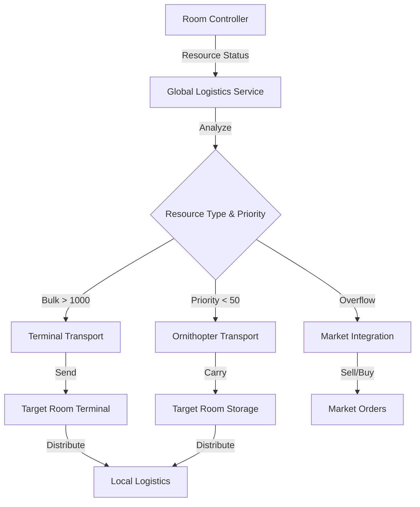

# Cross-Room Logistiksystem für Screeps

## Architektur-Überblick

Das System nutzt eine **Hybrid-Architektur** mit drei Transportebenen:

1. **Terminal-Transport** (Bulk): Für große Mengen, niedrige Priorität
2. **Ornithopter-Transport** (Priority): Für dringende Ressourcen, mittlere Mengen
3. **Market-Integration** (Overflow): Für Überschüsse und Notfälle

## Kernkomponenten

### 1. Global Resource Manager

- **Zweck**: Zentrale Übersicht über alle Ressourcen in allen Räumen
- **Features**:
  - Tracking von Storage/Terminal-Füllständen pro Raum
  - Identifikation von Defiziten und Überschüssen
  - Prioritätsberechnung basierend auf Raumstatus (z.B. kritische Controller-Energie)

### 2. Cross-Room Logistics Coordinator

- **Zweck**: Koordiniert Transporte zwischen Räumen
- **Features**:
  - Matching von Give- und Need-Orders über Räume hinweg
  - Transportmittel-Auswahl (Terminal vs. Ornithopter)
  - Route-Optimierung (kürzeste Wege, minimale Cooldowns)

### 3. Terminal Transport System (Erweiterung)

- **Aktueller Stand**: `internalTrade()` in [src/controller.terminal.js](src/controller.terminal.js) sendet bereits Ressourcen zwischen Räumen
- **Verbesserungen**:
  - Prioritätsbasiertes Routing (kritische Räume zuerst)
  - Batch-Transport (mehrere Ressourcen gleichzeitig)
  - Cooldown-Management (Terminal-Cooldowns berücksichtigen)
  - Energy-Cost-Optimierung (nur wenn profitabel)

### 4. Ornithopter Transport System (Erweiterung)

- **Aktueller Stand**: `getTransportOrderOrnithopter()` in [src/controller.room.logistics.js](src/controller.room.logistics.js) unterstützt bereits Batching
- **Verbesserungen**:
  - Cross-Room-Routing (Ornithopter können zwischen Räumen reisen)
  - Multi-Room-Batching (sammeln in Raum A, liefern in Raum B+C)
  - Prioritätsbasiertes Cross-Room-Matching

### 5. Hub-and-Spoke Model

- **Konzept**: Bestimmte Räume werden als Logistik-Hubs definiert
- **Vorteile**:
  - Zentralisierte Ressourcenverteilung
  - Reduzierte Terminal-Cooldowns (weniger direkte Transfers)
  - Bessere Skalierbarkeit bei vielen Räumen

## Implementierungsdetails

### Phase 1: Global Resource Tracking

**Neue Datei**: `src/service.globalLogistics.js`

```javascript
class GlobalLogisticsService {
  // Trackt alle Räume und ihre Ressourcenstände
  getGlobalResourceStatus(resourceType) {
    // Gibt Übersicht: welche Räume haben Überschuss, welche Defizit
  }
  
  // Findet beste Quelle für Ressourcenbedarf
  findBestSource(roomName, resourceType, amount, priority) {
    // Berücksichtigt: Distanz, Verfügbarkeit, Terminal-Cooldowns
  }
  
  // Findet beste Zielräume für Überschüsse
  findBestDestinations(sourceRoom, resourceType, amount) {
    // Priorisiert nach: Defizit-Größe, Raum-Priorität, Distanz
  }
}
```

### Phase 2: Cross-Room Matching

**Erweiterung**: `src/controller.room.logistics.js`

- Neue Methode: `getCrossRoomTransportOrder(creep)`
- Erweitert `givesResources()` und `needsResources()` um Cross-Room-Orders
- Integration mit GlobalLogisticsService

### Phase 3: Terminal Transport Optimierung

**Erweiterung**: `src/controller.terminal.js`

- Prioritätsbasiertes Routing in `internalTrade()`
- Batch-Transport (mehrere Ressourcen gleichzeitig)
- Cooldown-Optimierung (Terminal-Auslastung berücksichtigen)

### Phase 4: Ornithopter Cross-Room Support

**Erweiterung**: `src/behavior.transport.js` und `src/controller.room.logistics.js`

- Cross-Room-Pathfinding für Ornithopter
- Multi-Room-Order-Processing
- Integration mit Traveler-Library für Cross-Room-Movement

## Best Practices aus der Community

### 1. Terminal-First Strategie

- **Regel**: Terminal-Transport für alles > 1000 Einheiten
- **Grund**: Terminal-Transport ist energieeffizienter als Creep-Transport
- **Ausnahme**: Kritische Priorität (< 1000 ticks) → Ornithopter

### 2. Hub-Räume

- **Definition**: Räume mit guter Terminal-Position und zentraler Lage
- **Funktion**: Sammeln Überschüsse, verteilen Defizite
- **Vorteil**: Reduziert Anzahl direkter Transfers

### 3. Prioritäts-System

- **Kritisch** (Priority 1-10): Controller-Energie, Tower-Energie bei Angriff
- **Hoch** (Priority 11-50): Spawn-Energie, Extension-Energie
- **Normal** (Priority 51-100): Storage-Auffüllung, Terminal-Balancing
- **Niedrig** (Priority 101+): Überschuss-Vertrieb, Market-Trading

### 4. Energy-Cost-Bewusstsein

- **Terminal-Transport**: Berechnet Energie-Kosten pro Transfer
- **Ornithopter-Transport**: Berücksichtigt Travel-Costs
- **Entscheidung**: Wählt günstigste Option

### 5. Cooldown-Management

- **Terminal-Cooldowns**: Plant Transfers im Voraus
- **Queue-System**: Wartet auf Cooldown-Ende
- **Priorität**: Kritische Transfers können Cooldown überspringen

## Datenfluss



## Konfiguration

**Neue Constants** in `src/config.constants.js`:

```javascript
CROSS_ROOM: {
  TERMINAL_MIN_AMOUNT: 1000,        // Minimum für Terminal-Transport
  ORNITHOPTER_MAX_DISTANCE: 5,        // Max Räume für Ornithopter
  HUB_ROOMS: [],                      // Liste von Hub-Raum-Namen
  PRIORITY_CRITICAL: 10,              // Kritische Priorität
  PRIORITY_HIGH: 50,                  // Hohe Priorität
  ENERGY_COST_THRESHOLD: 0.1,         // Max Energie-Kosten pro Einheit
}
```

## Erwartete Verbesserungen

- **Durchsatz**: +100-200% durch optimierte Routen und Batching
- **Energie-Effizienz**: +50-80% durch Terminal-First-Strategie
- **Reaktionszeit**: -60% für kritische Ressourcen durch Prioritäts-Routing
- **CPU-Verbrauch**: +10-20% (durch Global-Tracking), aber kompensiert durch weniger ineffiziente Transfers

## Risiken und Mitigation

1. **CPU-Overhead**: Global-Tracking kann CPU-intensiv sein

   - **Mitigation**: Caching, nur bei Änderungen aktualisieren

2. **Terminal-Cooldowns**: Können Transporte verzögern

   - **Mitigation**: Queue-System, alternative Routen (Ornithopter)

3. **Komplexität**: System wird komplexer

   - **Mitigation**: Modulare Architektur, klare Interfaces

## Implementierungsreihenfolge

1. **Global Resource Tracking** (Grundlage für alles)
2. **Terminal Transport Optimierung** (schneller Gewinn)
3. **Cross-Room Matching** (Kern-Feature)
4. **Ornithopter Cross-Room Support** (Erweiterung)
5. **Hub-and-Spoke Model** (Optimierung)
6. **Market Integration** (Feinabstimmung)