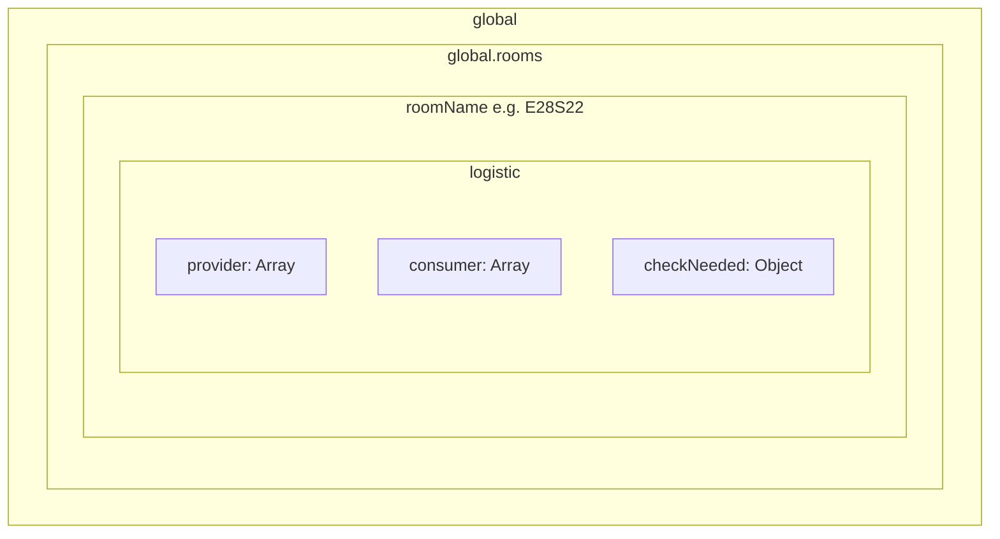

# New Logistic System (controller.room.logistics2.js)

## Data Structure Layout

All data is stored in `global`, not `Memory`. It persists tick-to-tick but is rebuilt on global reset.




---

## 1. Global Structure Initialization

**Path**: `global.rooms[roomName].logistic`

Initialize lazily when a room is processed. For each **owned** room (`room.controller && room.controller.my`):


| Key           | Type   | Description                                                            |
| ------------- | ------ | ---------------------------------------------------------------------- |
| `provider`    | Array  | Providers (sources that can give resources)                            |
| `consumer`    | Array  | Consumers (destinations that need resources)                           |
| `checkNeeded` | Object | Maps `logisticID` → `{ check, lastCheck }` for deferred re-check logic |


---

## 2. Provider Entry Schema (provide array)

Each entry in `provide`:


| Field           | Type   | Description                                                                                              |
| --------------- | ------ | -------------------------------------------------------------------------------------------------------- |
| `id`            | string | Game object ID for `Game.getObjectById(id)`                                                              |
| `logisticID`    | string | Unique ID: `{shard}{roomName}_{4digits}` e.g. `3E28S22_0666`                                             |
| `structureType` | string | e.g. `tombstone`, `storage`, `terminal`, `container`, `link`, `lab`, `factory`, `ruin`, `dropped`        |
| `priority`      | number | Uses [config.constants.js](src/config.constants.js) PRIORITY values (e.g. STORAGE_ENERGY_LOW, TOMBSTONE) |
| `resourceType`  | string | e.g. RESOURCE_ENERGY, RESOURCE_OXYGEN                                                                    |
| `amount`        | number | "all"                                                                                                    |


**logisticID generation**:

- Shard: `(Game.shard?.name || "shard0").replace("shard", "")` → e.g. `"3"`
- Room: `room.name`
- Random: 4-digit pad: `String(Math.floor(Math.random() * 10000)).padStart(4, "0")`
- Result: `${shard}${roomName}_${random}` e.g. `3E28S22_0666`

---

## 3. Consumer Entry Schema (consumer array)

Same structure as provide:


| Field           | Type   | Description              |
| --------------- | ------ | ------------------------ |
| `id`            | string | Game object ID           |
| `logisticID`    | string | Same format as providers |
| `structureType` | string | Same as provider         |
| `priority`      | number | From CONSTANTS.PRIORITY  |
| `resourceType`  | string |                          |
| `amount`        | number | "all"                    |


---

## 4. Check-Needed System (checkNeeded)

**Path**: `global.rooms[roomName].logistic.checkNeeded`

**Shape**: `{ [logisticID]: { check: boolean, lastCheck: number, structureType: string } }`

- `**check`**: Boolean. User will set this externally (do not set in code). When `true`, structure should be re-checked.
- `**lastCheck`**: Game tick of last validation. Used with per-type interval to force periodic re-check.
- `**structureType`**: Stored when entry is created (from provider/consumer). Used to look up the correct CHECK_INTERVAL for that type.
- **Constants** (in config.constants.js): `LOGISTIC.CHECK_INTERVAL` is an **object keyed by structureType**. Each type has its own interval in ticks.

**Logic**: A provider/consumer is only (re)validated when:

1. `checkNeeded[logisticID].check === true`, OR
2. `Game.time - checkNeeded[logisticID].lastCheck >= CHECK_INTERVAL[structureType]`

The controller does not set `check`; it only reads it and updates `lastCheck` after a check. Unknown structureTypes fall back to a default interval (e.g. 50).

---

## 5. File: controller.room.logistics2.js

**Responsibilities**:

1. `**ensureGlobalStructure(roomName)`**
  Initialize `global.rooms[roomName].logistic` with empty `provide`, `consumer`, and `checkNeeded` if missing.
2. `**generateLogisticID(room)`**
  Return a new unique logisticID for the room.
3. `**getOrCreateCheckEntry(roomName, logisticID)`**
  Return `checkNeeded[logisticID]`, creating `{ check: false, lastCheck: 0 }` if absent. Do not overwrite `check` if the user has set it.
4. `**shouldCheck(logisticID, roomName)`**
  Return true if `check === true` OR `(Game.time - lastCheck) >= CHECK_INTERVAL[structureType]`. Read `structureType` from `checkNeeded[logisticID]`. Use default interval if structureType not in config.
5. `**markChecked(roomName, logisticID)`**
  Set `checkNeeded[logisticID].lastCheck = Game.time`.
6. **Export**
  Class or module that can be used by ControllerRoom. No population of `provide`/`consumer` yet—only the data layout and helpers. Population will be added when the user integrates with structure scanning.

**Constants**: Add to [config.constants.js](src/config.constants.js) under a new `LOGISTIC` section. `CHECK_INTERVAL` is keyed by structureType so each type has its own re-check cadence:

```javascript
LOGISTIC: {
  CHECK_INTERVAL: {
    DEFAULT: 50,           // Fallback for unknown types
    tombstone: 20,         // Tombstones change often
    ruin: 20,              // Ruins disappear quickly
    dropped: 5,            // Dropped resources very dynamic
    container: 50,         // Containers at sources
    storage: 10,           // Storage changes frequently
    terminal: 25,          // Terminal inventory
    link: 5,               // Links charge/discharge quickly
    lab: 30,               // Lab input/output
    factory: 50,           // Factory production
    extension: 10,         // Extensions for spawning
    spawn: 5,              // Spawns need fast refill
    tower: 15,             // Towers
    // Add others as needed
  },
},
```

---

## 6. Integration Notes

- **Owned rooms**: Iterate `Game.rooms` and filter by `room.controller && room.controller.my`.
- **Consumer typo**: User wrote "comsumer"; implement as `consumer` (standard spelling).
- **No population logic**: This phase only creates the structure and helpers. Actual scanning of structures (tombstones, storage, etc.) and filling `provide`/`consumer` will be done by the user or in a later phase.
- **controller.room.js**: Do not wire in `logistics2` yet; it remains a standalone module until the user integrates it.

---

## Key Files


| File                                                                   | Action                        |
| ---------------------------------------------------------------------- | ----------------------------- |
| [src/controller.room.logistics2.js](src/controller.room.logistics2.js) | Create new                    |
| [src/config.constants.js](src/config.constants.js)                     | Add `LOGISTIC.CHECK_INTERVAL` |


